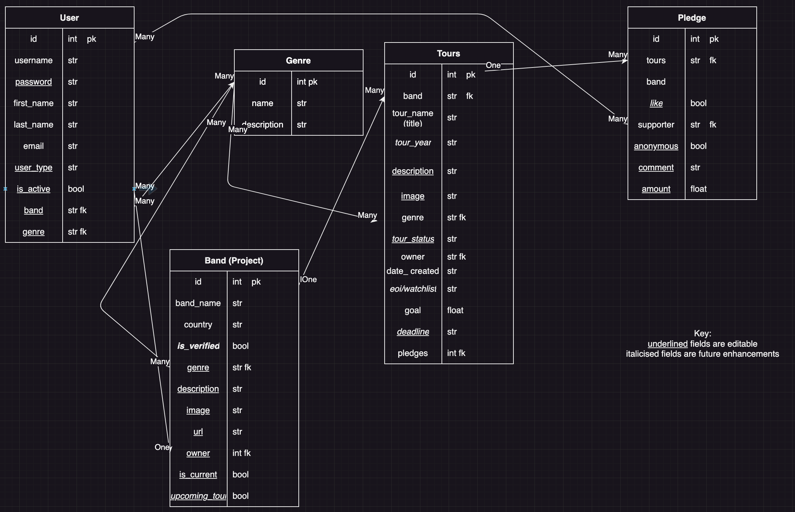
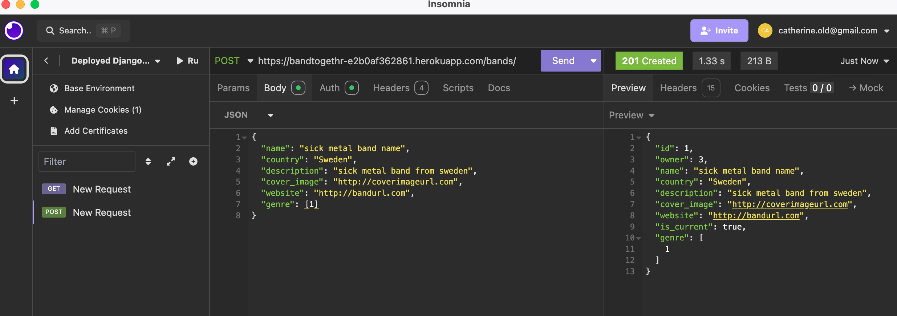
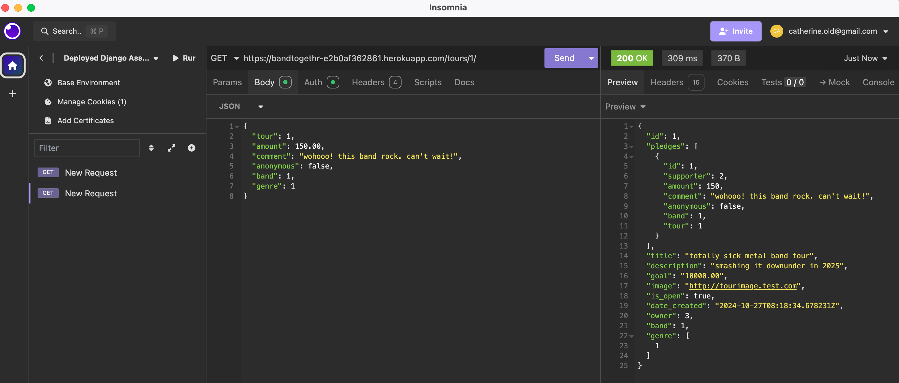
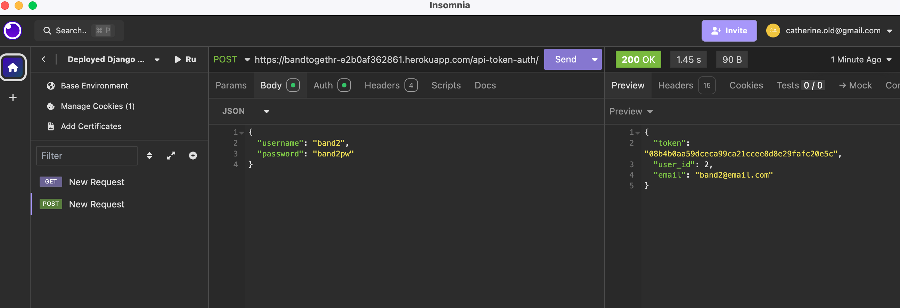

# Crowdfunding Back End

Catherine Blentweyne

## Planning

### bandtogethr

bandtogthr is a platform to raise funds to get international metal bands to come to include Perth on their tour downunder.

### Intended Audience/User Stories

This site is inteded to help international (and interstate) heavy metal bands to come to Perth. It is designed to support bands with smaller audiences that would not be able to tour Perth and is not intended for high-profile or mainstream metal bands that would perform in large venues.  

At present (25 October) anyone can create a band and a tour. There is currently no linkage between them.
It is hoped before front end finalised to implement that only a member of a band can create a band, and a tour for their band.
It is planned to implement in future deployments - timing TBC - the option for any band member to create a tour and have a verification method to ensure only bands meeting the criteria are using the site.

Individuals (supporters) can pledge to any open campaign.
A future enhancement will be to add a "like" function. Individuals could like a tour, but not pledge funds. And individuals can like a tour once funding target has been reached.

### Front End Pages/Functionality

- Home page
  - Recently added tours
  - Recently added bands
  - Login/Sign-up link
  - If user logged in, suggested bands/tours based on selected genres
  - All of above would provide option to 'view all', or click directly on item to view details
- Login / Sign-up page
  - Enter sign-in details for existing users
  - Enter details to create an account
- Bands page
  - Displays all bands listed on website, with options to filter by various options e.g. genre, open tour, etc
  - Each band listing links to band details page
- Band details page
  - Displays info on invidiual band
  - Option to make pledge (if current open tour)
- Tours page
  - Displays all tours listed on website, with options to filter by various options e.g. genre, open tour, etc. Default is open tours.
  - Each tour listing links to tour details page
- Tour details page
  - Displays info on invidiual tour
  - Option to make pledge (if current open tour)

Note currently genres is a separate page. Prior to implementation of front end this will be table that is not visible. Genres will be managed by admin and the field will only be available as dropdown list (for users, bands and tours) and as option to filter bands and tours.

### API Spec

| URL          | HTTP Method | Purpose                                                             | Request Body | Success Response Code             | Authentication/Authorisation                                       |
| ------------ | ----------- | ------------------------------------------------------------------- | ------------ | --------------------------------- | ------------------------------------------------------------------ |
| /band/   | GET | Return all projects | N/A | 200 | N/A                                                                |
| /band/   | POST   | Creates new band  | Band object | 201 | Must be logged  in (future enhancement - must be usertype band_member)  |
| /band/1/ | GET | Returns band with ID of '1'  | band object | 200| N/A |
| /band/1/ | PUT | Updates band with ID of '1' | Band object  | 200 | Must be logged in; and must be owner (future enhancement to add functionality for all band members associated with band) |
| /band/1/ | DELETE | Deletes band  with ID of '1' (and all associated pledges) | Band object | 201 | Must be logged in and must be project owner |
| /tours/   | GET | Return all tours | N/A | 200 | N/A                                                                |
| /tours/   | POST   | Creates new tour  | Tour object | 201 | Must be logged  in (future enhancement - must be usertype band_member)  |
| /tours/1/ | GET | Returns tours with ID of '1'  | Tour object | 200| N/A |
| /tours/1/ | PUT | Updates tours with ID of '1' | Tour object  | 200 | Must be logged in; and must be owner (future enhancement to add functionality for all band members associated with band) |
| /projects/1/ | DELETE | Deletes project  with ID of '1' (and all associated pledges) | Project object | 201 | Must be logged in and must be project owner |
| /users/    | POST        | Create new user| N/A | 201 | Must be logged in |
| /users/1 | PUT | Updates user with ID of '1' | User object | 200  | Must be logged in and pledge owner |
| /users/1/ | DELETE | Deletes user with ID of '1' (and all associated pledges) | Project object | 201 | Must be logged in and must be user |
| /pledges/ | POST | Create new pledge | N/A | 201 | Must be logged in (future enhancement to be user type supporter only) |

### DB Schema

### Step by step instructions

#### 1. Create new user

- Go to <https://bandtogethr-e2b0af362861.herokuapp.com/users/>
- Enter details
  - Required fields: "username", "password", "email" and "user_type" [note: user type options SU (supporter) and BM (band member)]
  - Optional fields: "first name", "last name", "*genre*", "*band*"
  - System-generated fields: "id", "date_joined". To determine if additional default fields of Abstract user will be utilised

#### 2. Create a new band

- Go to <https://bandtogethr-e2b0af362861.herokuapp.com/band/>
- User must be logged in. Note: future enhancement will mean that only users of user type "band member" will be able to create bands.
- Enter details
  - Required fields: "band_name" (must be unique), "country", "description", "cover_image", "website" and "genre"
  - System-generated fields: "id" and "owner"
  - Fields to be added (future enhancement) include "is_verfied" (managed by admin), "is_current" (managed by owner), and "upcoming_tour" (automated based on current open tours)
  - Future enhancement to timestamp "date_created"

#### 3. Create a new tour

- Go to <https://bandtogethr-e2b0af362861.herokuapp.com/tours/>
- User must be logged in. Note: future enhancement will mean that only users of user type "band member", associated with verified band, will be able to create tours. A band can only have one active (open) tour.
- Enter details:
  - Required fields: "title" (must be unique), "description", "goal", "image", "genre" (foreign key [int]), "band" (foreign key - int), and "is_open" (bool)
  - System-generated fields: "id", "date_created", "owner"
  - Fields to be added (future enhancement): "tour_year", "tour_status", "eoi/watchlist", and "deadline"

#### 4. Make a pledge

- Go to <https://bandtogethr-e2b0af362861.herokuapp.com/pledges/>
- User must be logged in.
- Enter details:
  - Required fields: "tours", "amount", "comment", "anonymous", "band" and "genre" (future enhancement would have these fileds pre-populated.)
  - System-generated fields: "id", "supporter"
  - Future enhancement to timestamp pledges

### Screenshots

#### POST request

#### GET request

### Authentication token

